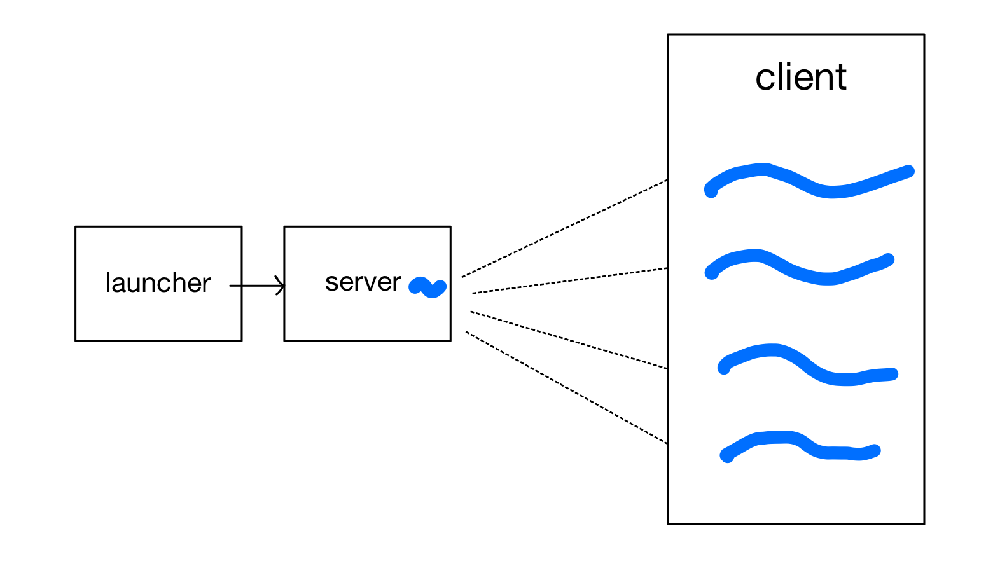
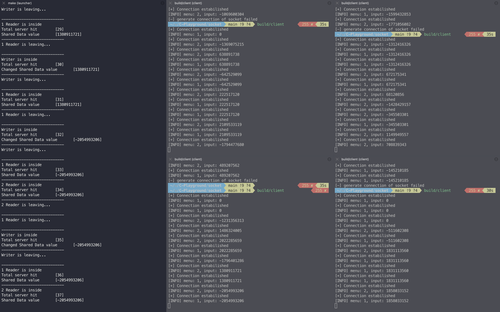

# Socket Programming
## Summary
Simple socket programming.

I apply **a threading algorithm** to control multiple clients simultaneously.
Especially, I focus on implemeting the algorithm for **the Readers-Writers Problem**.
There are three ways to solve the Readers-Writers Problem, so I selected one of them having a feature of *FAIRNESS*.

## Structure

- launcher : A manager might call this program to deal with server for convenience.
- server   : Server interface. Utilities for server are inside here.
- client   : Client interface. Utilities for client are inside here. Client should run separately just like real-world.

It is prihibited to access **directly** with calling functions from outside of launcher.
Please aware about this information.

## Screenshot
Test Environment: Mac OS

# Reference
1. Socket programming - Handling multiple clients on server with multithreading
   - https://www.geeksforgeeks.org/handling-multiple-clients-on-server-with-multithreading-using-socket-programming-in-c-cpp/?ref=rp
2. Readers-Writes Problem
   - https://en.wikipedia.org/wiki/Readers–writers_problem
